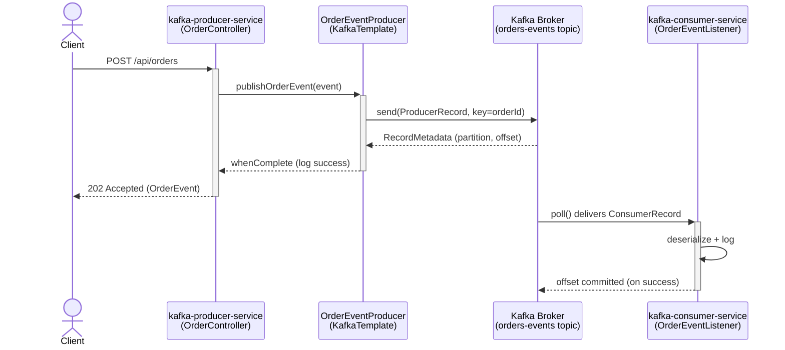

# Phase 1 & 2 — Project Setup, Local Kafka Infra, Producer/Consumer Flow

This is a combined doc covering the initial project scaffolding (Phase 1),
the local Kafka infrastructure that supports it, and the first working
end-to-end message flow (Phase 2). From Phase 3 onward, each phase gets
its own standalone doc.

---

## What's in this checkpoint

- Multi-module Maven project: `kafka-producer-service` + `kafka-consumer-service`
- Local Kafka broker (KRaft mode, single node) + kafka-ui, via Docker Compose
- `POST /api/orders` on the producer → `orders-events` topic → consumed and logged by the consumer

---

## How to Start

**1. Start the Kafka infrastructure**

```powershell
docker compose up -d
docker compose ps    # confirm kafka-broker shows "healthy"
```

**2. Start the consumer** (in its own terminal)

```powershell
cd kafka-consumer-service
mvn spring-boot:run
```

Wait for logs indicating partition assignment — that confirms it actually
joined the consumer group, not just that the app booted.

**3. Start the producer** (in a separate terminal)

```powershell
cd kafka-producer-service
mvn spring-boot:run
```

Runs on port `8081`. Consumer runs on port `8082`. Kafka broker on `9092`.
kafka-ui on `8080`.

---

## How to Test

**1. Trigger an event via REST**

```powershell
Invoke-RestMethod -Uri http://localhost:8081/api/orders `
  -Method Post `
  -ContentType "application/json" `
  -Body '{"customerId":"cust-1","amount":49.99}'
```

Expect: `202 Accepted` with the generated `OrderEvent` JSON body.

**2. Check producer logs**

Look for:
```
Published orderId=... to topic=orders-events partition=... offset=...
```

**3. Check consumer logs**

Look for:
```
Consumed orderId=... status=CREATED amount=49.99 from partition=... offset=...
```

**4. Verify via kafka-ui**

Open `http://localhost:8080` → Topics → `orders-events` → confirm the
message is visible with matching partition/offset. Under Consumers, check
`kafka-consumer-service-group` and its current offset.

**5. Sanity checks**

- Restart the consumer → it resumes from the last committed offset (no
  reprocessing of already-consumed records).
- Send two requests with different `customerId` but note that partition
  assignment is driven by `orderId` (the partition key), not `customerId`.

---

## Flow Diagram



---

## Key Things to Remember

- Spring Boot starting cleanly ≠ Kafka connectivity confirmed — connections are lazy.
- `KafkaTemplate.send()` is async; without a `whenComplete`/callback, failures are silently swallowed.
- Partition key = `orderId`, so all events for the same order stay ordered.
- `auto-offset-reset: earliest` only matters when no committed offset exists yet for the consumer group.