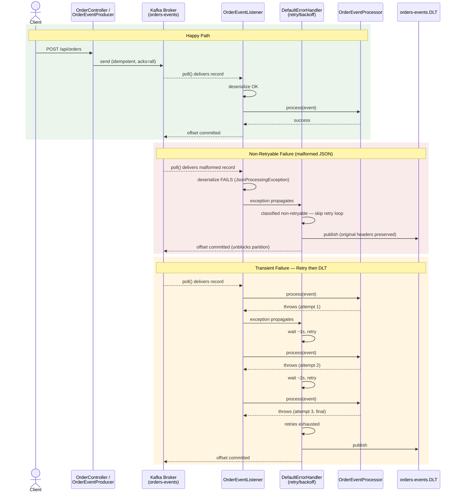

# Phase 3 — Reliability: Idempotent Producer, Retry/Backoff, Dead Letter Topic

## What's in this checkpoint

- Idempotent producer (`enable.idempotence=true`, `acks=all`) — retried
  sends can no longer create duplicate records on the broker
- Explicit topic provisioning (`orders-events`, `orders-events.DLT`) —
  no longer relying on broker auto-creation
- Consumer-side `DefaultErrorHandler`: 3 retries with exponential backoff
  (1s → 2s → 4s, capped at 10s, 15s max elapsed) for transient failures
- Non-retryable exception classification (deserialization/format errors)
  routed immediately to the DLT, skipping the retry loop entirely
- `OrderEventProcessor` seam extracted from the listener — the injection
  point for real business logic (and for tests to simulate failures)
- Full test suite: unit tests (Mockito) + `@EmbeddedKafka` integration
  tests covering happy path, non-retryable DLT routing, and
  retry-then-DLT for persistent failures

---

## How to Start

**1. Start the Kafka infrastructure**

```powershell
docker compose up -d
docker compose ps    # confirm kafka-broker shows "healthy"
```

**2. Start the consumer**

```powershell
cd kafka-consumer-service
mvn spring-boot:run
```

**3. Start the producer**

```powershell
cd kafka-producer-service
mvn spring-boot:run
```

**4. Confirm both topics exist**

Open `http://localhost:8080` (kafka-ui) → Topics → confirm both
`orders-events` and `orders-events.DLT` are listed (explicit provisioning
now, not lazy auto-create on first message).

---

## How to Test

### Automated (recommended first)

```powershell
mvn clean test
```

Runs from the repo root, executes all test classes in both modules.
Expect the retry-then-DLT test to visibly take several seconds — that's
real exponential backoff elapsing, not a hung test.

### Manual — Happy Path

```powershell
Invoke-RestMethod -Uri http://localhost:8081/api/orders `
  -Method Post -ContentType "application/json" `
  -Body '{"customerId":"cust-1","amount":49.99}'
```

Expect: producer logs `Published ...`, consumer logs `Consumed ...` and
`Processing orderId=...` (from `LoggingOrderEventProcessor`).

### Manual — Non-Retryable Failure (malformed JSON)

Via kafka-ui → `orders-events` topic → "Produce Message" → send a raw
value like `{not valid json` with any key.

Expect: **immediate** appearance in `orders-events.DLT` (check kafka-ui),
zero retry log lines, zero calls into the processor.

### Manual — Transient Failure (retry then DLT)

Temporarily throw a `RuntimeException` inside
`LoggingOrderEventProcessor.process()`, restart the consumer, and publish
a valid order.

Expect: 3 retry attempts in the logs with visibly increasing delay
(~1s, ~2s, ~4s), then the record appears in `orders-events.DLT`.
Revert the temporary throw afterward.

---

## Flow Diagram — Happy Path vs. Failure Path



---

## Key Things to Remember

- Idempotence guarantees exactly-once **per partition, per producer
  session** — it does not guarantee end-to-end exactly-once across the
  whole pipeline (that requires transactions, out of scope here).
- Non-retryable exceptions skip the backoff loop entirely — malformed
  data will never succeed on retry, so don't waste the attempts.
- The DLT offset still gets committed after publishing to the DLT — this
  is what unblocks the partition instead of stalling forever on a
  poison-pill message.
- **The DLT has no reader yet.** This phase builds the safety net, not
  the recovery process — that's a deliberately unbuilt piece, not an
  oversight.