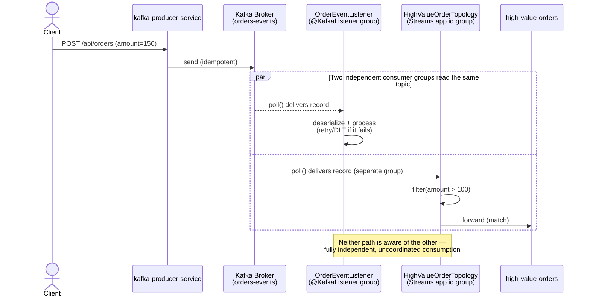

# Phase 4 — Kafka Streams: Stateless High-Value-Order Topology

## What's in this checkpoint

- Kafka Streams DSL enabled alongside the existing `@KafkaListener`
  consumption path (two independent readers of `orders-events`)
- Stateless topology: `orders-events` → filter (`amount > 100`) →
  `high-value-orders`
- `TopologyTestDriver`-based test suite — fully in-memory, no broker
- **Known gap:** malformed records in the Streams path are silently
  excluded (no DLT equivalent yet — Streams has its own, separate
  error-handling mechanism, deferred)

---

## How to Start

**1. Start infrastructure**
```powershell
docker compose up -d
docker compose ps
```

**2. Start the consumer** (now runs both the `@KafkaListener` and the
Streams topology in the same process)
```powershell
cd kafka-consumer-service
mvn spring-boot:run
```

**3. Start the producer**
```powershell
cd kafka-producer-service
mvn spring-boot:run
```

**4. Confirm topics**

Open `http://localhost:8080` → confirm `orders-events`,
`orders-events.DLT`, and `high-value-orders` all exist.

---

## How to Test

### Automated
```powershell
mvn clean test
```
The 4 `HighValueOrderTopologyTest` cases run in milliseconds — no
broker, no Docker, purely in-memory via `TopologyTestDriver`.

### Manual — high-value order
```powershell
Invoke-RestMethod -Uri http://localhost:8081/api/orders `
  -Method Post -ContentType "application/json" `
  -Body '{"customerId":"cust-1","amount":150.00}'
```
Expect: normal consumer logs (`Consumed ...`, `Processing ...`) **plus**
a routing log line, and the record appears in kafka-ui under
`high-value-orders`.

### Manual — low-value order (should NOT route)
```powershell
Invoke-RestMethod -Uri http://localhost:8081/api/orders `
  -Method Post -ContentType "application/json" `
  -Body '{"customerId":"cust-2","amount":25.00}'
```
Expect: normal consumption, nothing appears in `high-value-orders`.

### Manual — confirm dual, independent consumer groups

In kafka-ui → Consumers, confirm **two separate groups** both reading
`orders-events`: `kafka-consumer-service-group` (the `@KafkaListener`)
and the Streams `application-id` group — each with its own offset
tracking, unaware of the other.

---

## Flow Diagram



---

## Key Things to Remember

- Two consumer groups reading the same topic don't interfere — this is
  the same "independent readers" property from the Phase 1 concept
  brief, now demonstrated concretely.
- `TopologyTestDriver` is a fundamentally easier testing story than
  `@EmbeddedKafka`: synchronous, in-memory, no polling/timing races.
- **The Streams path has no DLT equivalent yet.** Malformed records are
  silently excluded from the filter — a real, acknowledged gap (ADR-006),
  not parity with the `@KafkaListener` path's Phase 3 reliability work.
- Debugging lesson from this phase: an unused/unattached `@Bean` doesn't
  error — it just silently does nothing. Always verify a configured
  component is actually wired into the thing that uses it, not just
  that it compiles and exists in the context.